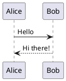

# Markdown文書執筆環境

このリポジトリは、VSCodeのDevContainerを使用したMarkdown文書執筆環境を提供します。

## 機能

- Markdown文書の編集とプレビュー
- PlantUMLによる図表作成
- Marpによるスライド作成
- PDF出力機能

## 必要条件

- Docker
- Visual Studio Code
- Remote - Containers 拡張機能

## 使用方法

1. このリポジトリをクローンします
2. VSCodeでリポジトリを開きます
3. コマンドパレット（`Ctrl+Shift+P` または `Cmd+Shift+P`）を開き、「Remote-Containers: Reopen in Container」を選択します
4. コンテナのビルドが完了するまで待ちます

## 主な機能の使い方

### Markdownプレビュー

- `Ctrl+Shift+V`（Windows/Linux）または `Cmd+Shift+V`（Mac）でプレビューを表示
- プレビューは自動的に更新されます

### PlantUML



- PlantUMLのコードブロックを記述すると、自動的にプレビューが生成されます
- プレビューは自動的に更新されます

### Marp

- `.md`ファイルの先頭に以下のフロントマターを追加してMarpスライドを作成：

```markdown
---
marp: true
theme: default
---
```

- `Ctrl+Shift+P`（Windows/Linux）または `Cmd+Shift+P`（Mac）で「Marp: Export Slide Deck...」を選択してPDFを出力

## 注意事項

- 初回起動時は、必要なパッケージのインストールに時間がかかる場合があります
- PDFの出力には日本語フォントが含まれています 