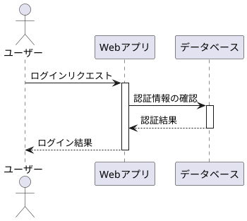
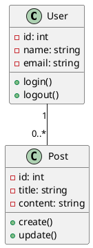
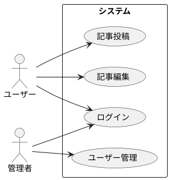
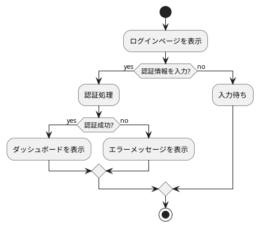

# PlantUMLサンプル

## シーケンス図

```plantuml
@startuml
actor ユーザー
participant "Webアプリ" as WA
participant "データベース" as DB

ユーザー -> WA: ログインリクエスト
activate WA
WA -> DB: 認証情報の確認
activate DB
DB --> WA: 認証結果
deactivate DB
WA --> ユーザー: ログイン結果
deactivate WA
@enduml
```

## クラス図

```plantuml
@startuml
class User {
  -id: int
  -name: string
  -email: string
  +login()
  +logout()
}

class Post {
  -id: int
  -title: string
  -content: string
  +create()
  +update()
}

User "1" -- "0..*" Post
@enduml
```

## ユースケース図

```plantuml
@startuml
left to right direction
skinparam packageStyle rectangle

actor ユーザー
actor 管理者

rectangle システム {
  usecase "ログイン" as UC1
  usecase "記事投稿" as UC2
  usecase "記事編集" as UC3
  usecase "ユーザー管理" as UC4
}

ユーザー --> UC1
ユーザー --> UC2
ユーザー --> UC3
管理者 --> UC1
管理者 --> UC4
@enduml
```

## アクティビティ図

```plantuml
@startuml
start
:ログインページを表示;
if (認証情報を入力?) then (yes)
  :認証処理;
  if (認証成功?) then (yes)
    :ダッシュボードを表示;
  else (no)
    :エラーメッセージを表示;
  endif
else (no)
  :入力待ち;
endif
stop
@enduml
``` 